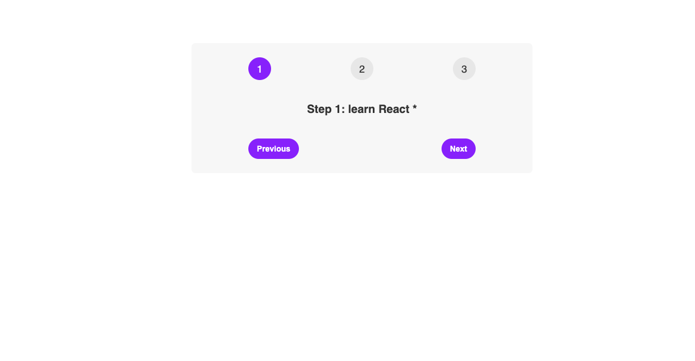

# StepsProject

About this Project
This Project uses React to create a simple interactive UI then allows some changes when the button is clicked

What I benefited from this exercise
Working on this project reinforces my understanding from the <a href="https://github.com/Muhammad-MO/PizzaMenu" target="blank">Pizza</a> project

1.Functional components
1.JSX elements,
2.Rendering data to the client side
3.Properties 4. Using State to handle changes

Resouces
W3 Schools
Stackoverflow

